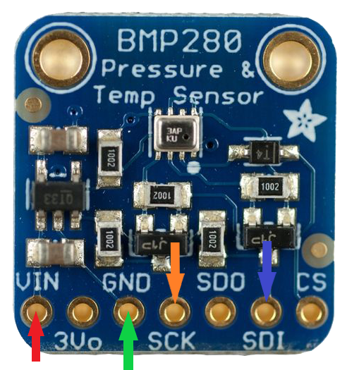
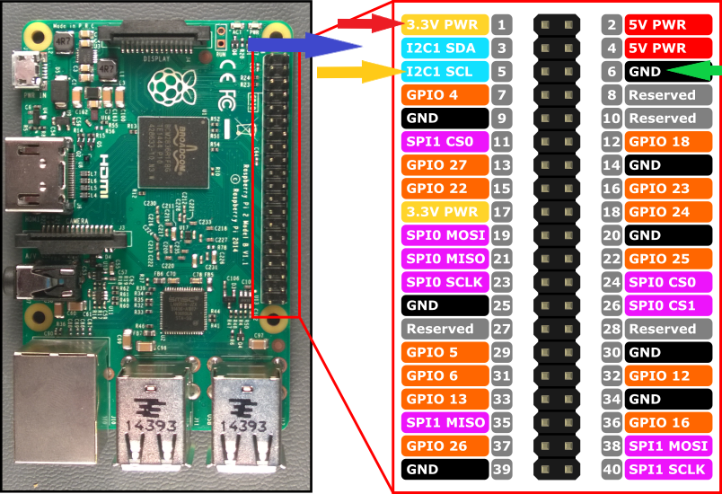

Temperature and Pressure Sensor on Python with BMP280 Sensor | Azure IoT Hub 
===================
**Library Used:** Adafruit_Python_BME280 *(Currently deprecated but works fine with below configuration.)*  
**Raspberry PI Version:** Raspberry PI 2 Model B *(Works with other too).*  
**Operating System:** Raspbian Jessie  
**Python Version:** Python 3.7.3  
#
## Pin Configuration
Since BMP280 Sbensor is available with 7 pin config we'll use only 4 pins here. Follow the below pin configuration to Raspberry PI. 
| BMP280 Sensor       | Raspberry Pi Pin|
| ------------- |:-------------:|
| VIN (1)    | 3V3 (1) |
| GND (3)     | GND (6)      |
| SCK (4) | SCL 1 (5)      |
| SDI (6) | SDA 1 (3)      |

### Please refer to the below figure for clear view:  
#### BMP280 Sensor :


#### Raspberry PI 2 Model B:


#
## Requirements

This driver requires that you have previously installed the
[Adafruit_Python_GPIO](https://github.com/adafruit/Adafruit_Python_GPIO) package.

On Raspbian, you can install this package with the following commands:

```
sudo apt-get update
sudo apt-get install build-essential python-pip python-dev python-smbus git
git clone https://github.com/adafruit/Adafruit_Python_GPIO.git
cd Adafruit_Python_GPIO
sudo python setup.py install
```

## Usage

To run the code connect your Pi to the BME280 breakout using I2C (connect SCL to the SCK pin and SDA
to the SDI pin), and run the following command from this folder:

```
python BMP.py
```

## Credits
### [Milan Thapa](https://link2rn.me)
Email: aryan@sochware.com  
Linkedin: [link2rn](https://www.linkedin.com/in/link2rn/)  
Twitter:  [link2rn](https://twitter.com/link2rn/)    
#
This driver is based on the [Adafruit_BMP](https://github.com/adafruit/Adafruit_Python_BMP)
driver by Tony DiCola (Adafruit Industries), with BME280 additions kindly provided by
David J. Taylor (www.satsignal.eu).

# MIT License

Permission is hereby granted, free of charge, to any person obtaining a copy
of this software and associated documentation files (the "Software"), to deal
in the Software without restriction, including without limitation the rights
to use, copy, modify, merge, publish, distribute, sublicense, and/or sell
copies of the Software, and to permit persons to whom the Software is
furnished to do so, subject to the following conditions:

The above copyright notice and this permission notice shall be included in
all copies or substantial portions of the Software.

THE SOFTWARE IS PROVIDED "AS IS", WITHOUT WARRANTY OF ANY KIND, EXPRESS OR
IMPLIED, INCLUDING BUT NOT LIMITED TO THE WARRANTIES OF MERCHANTABILITY,
FITNESS FOR A PARTICULAR PURPOSE AND NONINFRINGEMENT. IN NO EVENT SHALL THE
AUTHORS OR COPYRIGHT HOLDERS BE LIABLE FOR ANY CLAIM, DAMAGES OR OTHER
LIABILITY, WHETHER IN AN ACTION OF CONTRACT, TORT OR OTHERWISE, ARISING FROM,
OUT OF OR IN CONNECTION WITH THE SOFTWARE OR THE USE OR OTHER DEALINGS IN
THE SOFTWARE.
